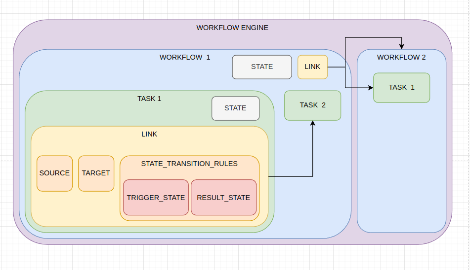

# Workflow Engine

Hello Supplios Team! Welcome to my solution (or partial solution) to the challenge. Where I aim to create a simple implementation of a workflow engine. I have decided to code in Python as I am more confident in this programming language. 


## Introduction
There are three components `Workflow`, `Tasks` and `Links`. Additionally, there is an extra class called `StateStatus` where the possible states of `Tasks` and `Workflow` are defined. The primary goal of this engine is to manage and track the state transitions of workflows and tasks.

## Folder Structure
```
├── img
│   └── Workflow-engine-diagram.png
├── README.md
├── tests
│   └── test_workflow.py
├── workflow-engine.py
└── workflow.py
```
- **img**: Contains diagrams or visual representations related to the workflow engine.
- **README.md**: Documentation for the project.
- **tests**: Includes unit tests for the workflow engine implementation.
- **workflow-engine.py**: Script for running the use case of the workflow engine: Onboarding (the class-orchestrator is not yet defined).
- **workflow.py**: Contains the core logic and implementation of the Workflow, Tasks and Links.

## Code Flow Explanation

### Classes and Their Responsibilities, all of them can be found on workflow.py
1. **`StateStatus`**: An `Enum` representing the possible states for tasks and workflows:
    - `PENDING`: Initial state.
    - `IN_PROGRESS`: Indicates the task or workflow is currently active.
    - `COMPLETED`: Indicates the task or workflow is finished.

2. **`WorkFlow`**: Represents a collection of tasks and manages their states.
    
    - Attributes:
        - `name`: Name of the workflow.
        - `_state`: Current state of the workflow.
        - `_tasks`: List of tasks associated with the workflow.
        - `_link`: A link to another task or workflow.
    - Key Methods:
        - `add_task(task)`: Adds a task to the workflow.
        - `add_link(link)`: Links the workflow to another task or workflow.
        - `on_task_state_changed()`: Updates the workflow's state based on the states of its tasks.
        - `change_state(new_state)`: Changes the state of the workflow and triggers linked workflows if applicable.

3. **`Task`**: Represents an individual task that is part of a workflow.
    - Attributes:
        - `name`: Name of the task.
        - `workflow_parent`: The parent workflow this task belongs to.
        - `_state`: Current state of the task.
        - `_link`: A link to another task or workflow.
    - Key Methods:
        - `add_link(link)`: Links the task to another task or workflow.
        - `change_state(new_state)`: Updates the task's state and triggers state changes in the parent workflow or linked tasks/workflows.

4. **`Link`**: Represents a connection between a source and a target, enabling one to trigger state changes in the other.
    - Attributes:
        - `source`: The task or workflow that triggers the link.
        - `trigger_state`: The state in the source that activates the link.
        - `target`: The task or workflow affected by the link.
        - `update_state`: The state applied to the target when the link is triggered.
    - Key Method:
        - `on_source_state_changed()`: Checks the source's state and updates the target's state if conditions are met.


Below, a representation of the workflow engine can be found, representing the compoenents and how this components are linked inbetween.




## How It Works
1. Define a workflow using the `WorkFlow` class.
2. Add tasks to the workflow using `add_task`.
3. Optionally, link tasks or workflows using the `Link` class to create dependencies or triggers.
4. Update the state of individual tasks using `change_state`. The workflow's state will automatically update based on the states of its tasks.
5. Linked tasks or workflows will respond automatically when their associated triggers are activated.

## How to run the code

1. Clone the repo: `git clone https://github.com/AlexAbades/workflow-engine.git`
2. Access the folder **workflow-engine**: `cd workflow-engine`
3. Run the script **workflow-engine.py** in order to see a worklow in progress: `python3 workflow-engine.py`
4. The code showcases an onboarding process, which is already defined. It will prompt you to press de key `Enter` in order to continue with the execution. and will print the different components a workflow engine may have.

---

## Potential Upgrades
1. **Workflow Engine**: Right now, the entry point is just a use case with some prints, a class workflow engine should be defined in order to orchastate the worflows. 
2. **Support Multiple Links**: Currently, tasks and workflows can have only one link. Extend this to allow multiple links so one task can be linked to multiple task and/or workflows. 
3. **Restoring a previous state**: Currently, once a task triggers the change from its linked task the state can not be reversed. This is, when `Sign Up` COMPLETED trigers `Verify Email` into IN_PROGRESS, both tasks states cannot be restored by changing `Verify Email` into PENDING. 
4. **Update Tasks Stats**: Currently, if we change the Workflow State to COMPLETED or PENDING, all tasks are not enforced to change its state into COMPLETED or PENDING, respectively.


